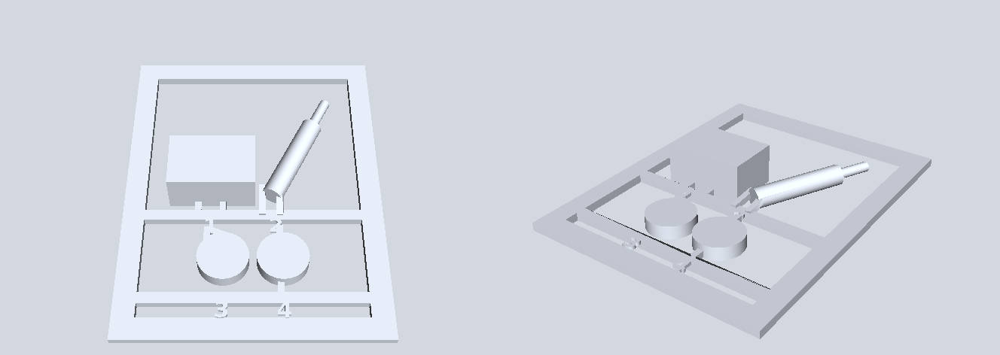

# 3d-card

3d-card turns a set of 3D-printable parts into one printable card, like the sprue of a plastic model kit. The parts sit on a flat frame, each held by small gates at the bottom, and you print the whole card in one go, cut the parts off and put them together. Before it gives you the card, it cuts every gate itself and checks that every part comes back whole and loose (the round trip).

I wrote it for a posable toy figure I designed and printed, and I could not find a public tool that makes this kind of card. It also has the print-in-place joints and the printability checks I needed on the way.



## Install

```bash
pip install 3d-card
pip install "3d-card[sim]"     # adds the MuJoCo stand-up test and convex decomposition
```

In Python it is imported as `card3d`. It uses build123d (the CAD kernel), trimesh and manifold3d for the geometry, and [3d-base](https://github.com/drkostas/3d-base) for mesh loading and pictures.

## Make a card

You give it a function that returns your parts, the joints between them and a list of notes.

```python
import trimesh
from card3d import tosprue

def source():
    parts = {"body": trimesh.load("body.stl"), "arm": trimesh.load("arm.stl"), "wheel": trimesh.load("wheel.stl")}
    joints = []            # optional, see below
    return parts, joints, []

got, report = tosprue.best_card(source=source)
print(got["size"], got["fits_bed"], report["ok"])
got["card"].export("card.stl")
```

`best_card` tries a few layouts and keeps the smallest one whose round trip passes. `build` makes one card with the options you pass. `export(out="card", name="card.stl", ...)` builds and writes it.

What it does, in order.

1. Each part is turned so it rests on a face with enough first layer. A part with only a few square millimetres on the plate comes loose in the first layers and the nozzle drags it away.
2. The parts are laid out in rows, with a runner bar under each row.
3. Gates are placed at the bottom of each part, in the frame's own plane, where the part comes closest to its bar. A gate higher up would print in the air.
4. Each part gets a small number stamped on the frame next to it.
5. The card is made into one solid, the gates are cut, and every piece is matched back to its part by area and size.

The card is as tall as its tallest part, and it is checked against your printer's bed (`bed=(width, depth)` in mm, or set `card3d.sprue.BED`).

### A card you can read

By default the parts go into one row after another. To make the card read like the finished model (head at the top, legs lower down, and so on), pass the rows yourself.

```python
tosprue.build(source=source,
              rows=[["head"], ["arm_left", "body", "arm_right"], ["leg_left", "leg_right"]],
              down=["arm_left", "arm_right", "leg_left", "leg_right"],   # long axis down the card
              across=["head"])                                         # long axis across it
```

Parts you do not name go into a last row. Someone can then put the kit together without instructions.

### Joints

`card3d.joints` makes the two halves of a joint (`male` is what sticks out, `female` is what is cut away) for pegs, axles, pivots, ball joints, tabs and cross laps. The clearances were measured on a real printer with the two test prints in `card3d.coupons` (0.30 mm for push fits, 0.20 mm for a pivot that holds its pose). Print the coupons on your own printer and change `joints.CLEAR` and `joints.PIVOT_CLEAR` if yours differ.

If you list your joints in the source as `{"type": "peg", "size": 3.0, "axis": (1, 0, 0), "at": (x, y, z), "child": "arm", "parent": "body"}`, the card keeps gates away from them and does not cut a part's sole through a peg.

## Flat cards and checks

- `card3d.sprue.make_card` makes the flat version, a kit card of flat plates of one thickness, and `card3d.roundtrip.check` cuts it and checks every plate comes back.
- `card3d.simulator` reports overhangs and where supports would leave marks, sweeps a peg into its socket to find collisions, finds the best print orientation, and with the `sim` extra decomposes a part into convex pieces and tests in MuJoCo whether the assembled model stands.
- `card3d.labels` makes small 3D numbers for parts and cards.

## Claude Code skill

```bash
3d-card skill             # copies it to ~/.claude/skills/3d-card
```

The skill gives Claude the whole procedure we used, in order. It starts with measuring clearances on your printer and goes through joints, building the card, reading its notes and the round trip, and checking the slice, up to the first physical print. It ends with a table of the failures we met (a card that printed as spaghetti, gates that cut a joint, parts that stayed on the frame) with how to check and fix each one.

## Limits

- It was built for one toy with about twenty parts. Cards with many more parts work, but the layout is a row packer, not an optimiser.
- The round trip proves the gates can be cut in the model. Gate size still depends on your material and cutters, so print one card before printing many.
- The clearances are from one printer and PLA.

## Development

```bash
python -m venv .venv && .venv/bin/pip install -e '.[test,sim]'
.venv/bin/pytest
python examples/make_example.py   # rebuilds docs/example.png
```

## License

MIT
